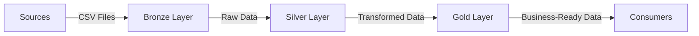

# SQL Data Warehouse Project

> **A modern data warehousing and analytics solution built with PostgreSQL on Aiven**

---

## 📌 **Project Overview**

This project demonstrates a **comprehensive data warehousing and analytics solution** using **PostgreSQL** managed on **Aiven**. It covers the entire pipeline: from **data ingestion** and **ETL processes** to **data modeling**, **transformation**, and **business-ready analytics**.

Designed as a **portfolio project**, it showcases **industry best practices** in **data engineering** and **analytics**, making it ideal for learning, collaboration, or production use.

---

## 🏗️ **Architecture**

The project follows a **multi-layered data architecture** to ensure scalability, maintainability, and performance:



### **Layers**


| Layer      | Description                                     | Object Type | Load Type                   | Transformations                                                                  | Data Model                                |
| ---------- | ----------------------------------------------- | ----------- | --------------------------- | -------------------------------------------------------------------------------- | ----------------------------------------- |
| **Bronze** | Raw data from sources (CRM, ERP, etc.)          | Tables      | Batch Processing, Full Load | None                                                                             | None                                      |
| **Silver** | Cleaned, standardized, and normalized data      | Tables      | Batch Processing, Full Load | Data Cleansing, Standardization, Normalization, Derived Columns, Data Enrichment | None                                      |
| **Gold**   | Business-ready data for analytics and reporting | Views       | No Load                     | Data Integrations, Aggregations, Business Logic                                  | Star Schema, Flat Table, Aggregated Table |


---

## 📂 **Project Structure**

```
SQL_Data_Warehousing_Project/
├── datasets/          # Sample datasets (CSV files)
├── docs/             # Documentation and diagrams
├── scripts/          # SQL scripts for ETL, modeling, and analytics
│   ├── bronze/       # Bronze layer scripts
│   ├── silver/       # Silver layer scripts
│   └── gold/         # Gold layer scripts
├── tests/            # Test scripts for validation
├── LICENSE           # MIT License
└── README.md         # Project documentation
```

---

## 🛠️ **Technologies Used**

- **Database**: PostgreSQL (Managed on **Aiven**)
- **Data Ingestion**: CSV files (CRM, ERP, etc.)
- **ETL/ELT**: SQL scripts for transformation
- **Data Modeling**: Star Schema, Flat Tables, Aggregated Tables
- **Analytics**: BI &amp; Reporting, Ad-Hoc SQL Queries, Machine Learning

---

## 🚀 **Getting Started**

### **Prerequisites**

- PostgreSQL database (Aiven or self-hosted)
- Basic knowledge of SQL
- CSV files for data ingestion (sample datasets provided)

### **Setup**

1. **Clone the repository**:
  ```bash
   git clone https://github.com/mac0duor0fficial/SQL_Data_Warehousing_Project.git
  ```
2. **Set up PostgreSQL**:
  - Create a database on Aiven or your local PostgreSQL instance.
  - Update connection details in the scripts.
3. **Load data**:
  - Place your CSV files in the `datasets/` folder.
  - Run the scripts in the `scripts/bronze/` folder to ingest raw data.
4. **Transform data**:
  - Execute the scripts in `scripts/silver/` to clean and standardize data.
  - Run the scripts in `scripts/gold/` to create business-ready views.
5. **Analyze data**:
  - Use the Gold layer views for BI, reporting, or machine learning.

---

## 📊 **Data Flow**

1. **Sources**: CRM, ERP, and other systems export data as CSV files.
2. **Bronze Layer**: Raw data is loaded into PostgreSQL tables without transformations.
3. **Silver Layer**: Data is cleaned, standardized, and enriched.
4. **Gold Layer**: Business logic is applied to create aggregated, integrated, and actionable datasets.
5. **Consumers**: BI tools, ad-hoc queries, and machine learning models consume the Gold layer data.

---

## 🔍 **Key Features**

- **Scalable Architecture**: Multi-layered design for easy maintenance and scalability.
- **ETL Best Practices**: Batch processing, data cleansing, and normalization.
- **Business-Ready Data**: Star schemas, aggregated tables, and integrated datasets.
- **Analytics-Ready**: Optimized for BI tools, SQL queries, and machine learning.

---

## 🤝 **Contributing**

Contributions are welcome! Feel free to:

- Report issues or suggest improvements.
- Submit pull requests for new features or bug fixes.
- Share your own ETL scripts or data models.

---

## 📜 **License**

This project is licensed under the **MIT License** – see the [LICENSE](LICENSE) file for details.

---

## 📞 **Contact**

For questions or collaboration, reach out to:

- **Email**: [mac0duor0fficial@gmail.com](mailto:mac0duor0fficial@gmail.com)
- **GitHub**: [mac0duor0fficial](https://github.com/mac0duor0fficial)

---

